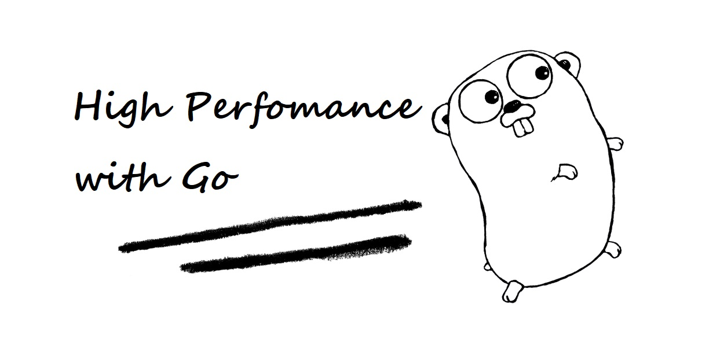

## 这个系列的由来

我使用 Go 作为主力编程语言已经有一年多的时间了，主要的工作职责是开发一些效率工具，例如分布式编译加速工具。对性能不太敏感的地方，通常会使用 Python，因为 Python 在文本处理上有其他语言不可比拟的优势，而在一些对性能特别敏感的地方，则会选择 Go。Go 语言让我最为推崇的莫过于 Go 的并发，协程加信道，sync 加 select，我觉得很难再有那么一门语言，并发能够做得像 Go 一样简单。

为了加深对 Go 的理解，我尝试去学习一些著名的开源项目，比如分布式缓存 groupcache。知乎上有个问题，“[有哪些值得学习的 Go 语言开源项目？](https://www.zhihu.com/question/20801814/answer/1534555951)”，这个回答下面，groupcache 被提到了不下 3 次。groupcache 代码精炼、功能强大，堪比缓存的瑞士军刀。一个好的项目肯定是备受推崇的，从这些优秀的项目中汲取精华，我觉得是掌握一门语言最快速的方式。因此，我创建了一个项目，叫做 [7days-golang](https://github.com/geektutu/7days-golang)，七天用 Go 模仿一个开源项目，希望用 1000 行不到的代码去模仿开源项目中最为精华的部分。这个项目也让我受益匪浅，在这个过程中学习到的一些编程方法和思想，也让我的工作变得有趣了起来。一些优雅的设计和实现，代码量极少，效率又极高。比如一致性哈希，single flight 等等。

通过学习一些著名的开源项目和 Go 的源码，也掌握了很多编程的技巧，知道怎么写才能获得更好的性能。这些技巧是零散的，我一直希望能够将这些技巧系统地整理出来，不断地完善，最终形成一本高性能编程的指南。因此，开启了 [Go 语言高性能编程](https://github.com/geektutu/high-performance-go) 这个电子书项目。这个项目刚起步，处于一个逐步完善的过程，与各位童鞋共勉。

## 这本书适合谁？

如果你是 Go 的初学者，建议先阅读 [Go 语言简明教程](https://geektutu.com/post/quick-golang.html)，一篇文章了解 Go 的基础语法。这本书适合使用 Go 作为主力编程语言已经有一段时间，希望进一步提升 Go 编程技巧的童鞋。

## 推荐和参考

- [Go 语言笔试面试题汇总](https://geektutu.com/post/qa-golang.html)
- [七天用Go从零实现系列](https://geektutu.com/post/gee.html)
