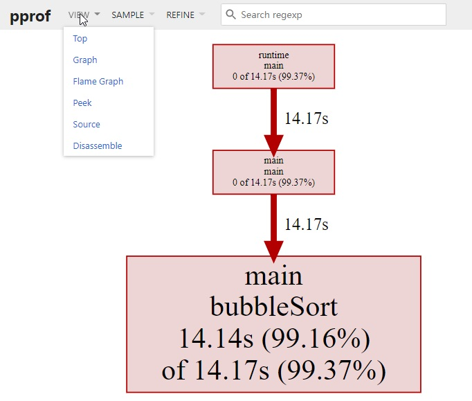

benchmark(基准测试) 可以度量某个函数或方法的性能，也就是说，如果我们知道性能的瓶颈点在哪里，benchmark 是一个非常好的方式。但是面对一个未知的程序，如何去分析这个程序的性能，并找到瓶颈点呢？

[pprof](https://github.com/google/pprof) 就是用来解决这个问题的。pprof 包含两部分：

- 编译到程序中的 `runtime/pprof` 包
- 性能剖析工具 `go tool pprof`

## 1 性能分析类型

### 1.1 CPU 性能分析

CPU 性能分析(CPU profiling) 是最常见的性能分析类型，也是最明显的。

启动 CPU 分析时，运行时(runtime) 将每隔 10ms 中断一次，记录此时正在运行的协程(goroutines) 的堆栈信息。

程序运行结束后，可以分析记录的数据找到最热代码路径(hottest code paths)。

> Compiler hot paths are code execution paths in the compiler in which most of the execution time is spent, and which are potentially executed very often.
> -- [What's the meaning of “hot codepath”](https://english.stackexchange.com/questions/402436/whats-the-meaning-of-hot-codepath-or-hot-code-path)

一个函数在性能分析数据中出现的次数越多，说明执行该函数的代码路径(code path)花费的时间占总运行时间的比重越大。

### 1.2 内存性能分析

内存性能分析(Memory profiling) 记录堆内存分配时的堆栈信息，忽略栈内存分配信息。

内存性能分析启用时，默认每1000次采样1次，这个比例是可以调整的。因为内存性能分析是基于采样的，因此基于内存分析数据来判断程序所有的内存使用情况是很困难的。

### 1.3 阻塞性能分析

阻塞性能分析(block profiling) 是 Go 特有的。

阻塞性能分析用来记录一个协程等待一个共享资源花费的时间。在判断程序的并发瓶颈时会很有用。阻塞的场景包括：

- 在没有缓冲区的信道上发送或接收数据。
- 从空的信道上接收数据，或发送数据到满的信道上。
- 尝试获得一个已经被其他协程锁住的排它锁。

一般情况下，当所有的 CPU 和内存瓶颈解决后，才会考虑这一类分析。

### 1.4 锁性能分析

锁性能分析(mutex profiling) 与阻塞分析类似，但专注于因为锁竞争导致的等待或延时。

## 2 收集并分析性能数据

> 记录性能数据会对程序的性能产生影响，建议一次只记录一类数据。

### 2.1 生成 profile

Go 的运行时性能分析接口都位于 `runtime/pprof` 包中。只需要调用 `runtime/pprof` 库即可得到我们想要的数据。

假设我们实现了这么一个程序，随机生成了 5 组数据，并且使用冒泡排序法排序。

```go
// main.go
package main

import (
	"math/rand"
	"time"
)

func generate(n int) []int {
	rand.Seed(time.Now().UnixNano())
	nums := make([]int, 0)
	for i := 0; i < n; i++ {
		nums = append(nums, rand.Int())
	}
	return nums
}
func bubbleSort(nums []int) {
	for i := 0; i < len(nums); i++ {
		for j := 1; j < len(nums)-i; j++ {
			if nums[j] < nums[j-1] {
				nums[j], nums[j-1] = nums[j-1], nums[j]
			}
		}
	}
}

func main() {
	n := 10
	for i := 0; i < 5; i++ {
		nums := generate(n)
		bubbleSort(nums)
		n *= 10
	}
}
```

如果我们想度量这个应用程序的 CPU 性能数据，只需要在 main 函数中添加 2 行代码即可：

```go
import (
	"math/rand"
	"os"
	"runtime/pprof"
	"time"
)

func main() {
	pprof.StartCPUProfile(os.Stdout)
	defer pprof.StopCPUProfile()
	n := 10
	for i := 0; i < 5; i++ {
		nums := generate(n)
		bubbleSort(nums)
		n *= 10
	}
}
```

为了简单，直接将数据输出到标准输出 `os.Stdout`。运行该程序，将输出定向到文件 `cpu.pprof` 中。

```bash
$ go run main.go > cpu.pprof
```

一般来说，不建议将结果直接输出到标准输出，因为如果程序本身有输出，则会相互干扰，直接记录到一个文件中是最好的方式。

```go
func main() {
	f, _ := os.OpenFile("cpu.pprof", os.O_CREATE|os.O_RDWR, 0644)
	defer f.Close()
	pprof.StartCPUProfile(f)
	defer pprof.StopCPUProfile()
	n := 10
	for i := 0; i < 5; i++ {
		nums := generate(n)
		bubbleSort(nums)
		n *= 10
	}
}
```

这样只需运行 `go run main.go` 即可。


### 2.2 分析数据

接下来，可以用 `go tool pprof` 分析这份数据

```bash
$ go tool pprof -http=:9999 cpu.pprof
```

如果提示 Graphviz 没有安装，则通过 `brew install graphviz`(MAC) 或 `apt install graphviz`(Ubuntu) 即可。

访问 `localhost:9999`，可以看到这样的页面：



除了在网页中查看分析数据外，我们也可以在命令行中使用交互模式查看。

```bash
$ go tool pprof cpu.pprof
File: main
Type: cpu
Time: Nov 19, 2020 at 1:43am (CST)
Duration: 16.42s, Total samples = 14.26s (86.83%)
Entering interactive mode (type "help" for commands, "o" for options)
(pprof) top
Showing nodes accounting for 14.14s, 99.16% of 14.26s total
Dropped 34 nodes (cum <= 0.07s)
      flat  flat%   sum%        cum   cum%
    14.14s 99.16% 99.16%     14.17s 99.37%  main.bubbleSort
         0     0% 99.16%     14.17s 99.37%  main.main
         0     0% 99.16%     14.17s 99.37%  runtime.main
```

可以看到 `main.bubbleSort` 是消耗 CPU 最多的函数。

还可以按照 `cum`(累计消耗)排序：

```bash
(pprof) top --cum
Showing nodes accounting for 14.14s, 99.16% of 14.26s total
Dropped 34 nodes (cum <= 0.07s)
      flat  flat%   sum%        cum   cum%
    14.14s 99.16% 99.16%     14.17s 99.37%  main.bubbleSort
         0     0% 99.16%     14.17s 99.37%  main.main
         0     0% 99.16%     14.17s 99.37%  runtime.main
```

`help` 可以查看所有支持的命令和选项：

```bash
(pprof) help
  Commands:
    callgrind        Outputs a graph in callgrind format
    comments         Output all profile comments
    disasm           Output assembly listings annotated with samples
    dot              Outputs a graph in DOT format
    eog              Visualize graph through eog
    evince           Visualize graph through evince
    gif              Outputs a graph image in GIF format
    gv               Visualize graph through gv
	......
```