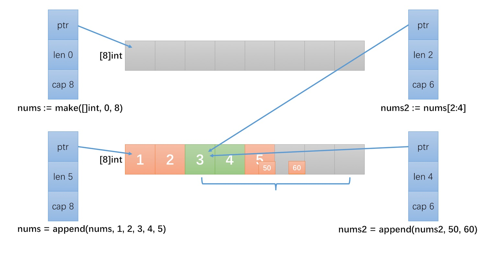
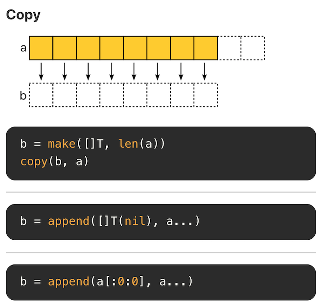
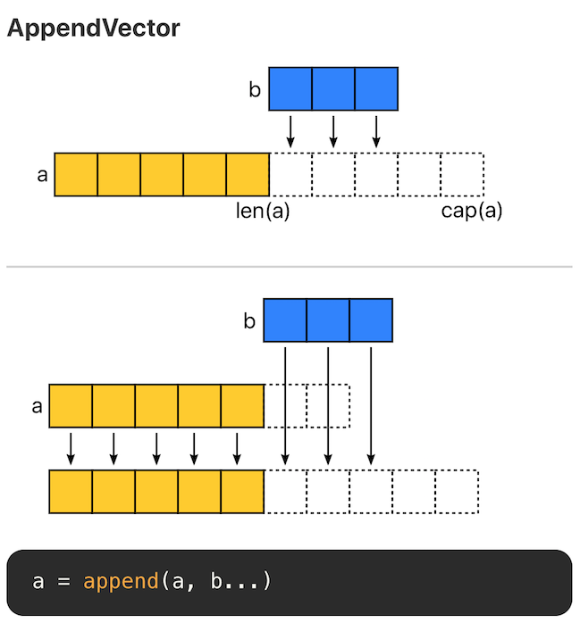
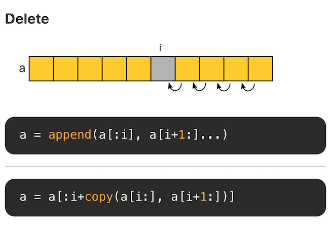
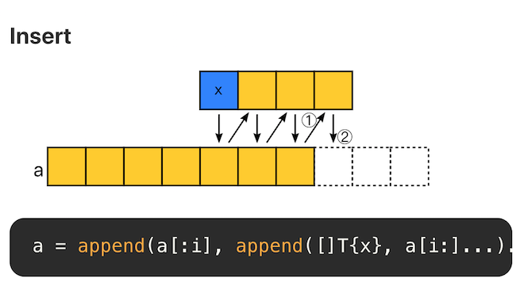
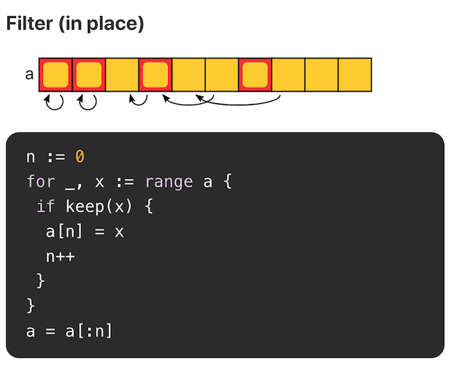
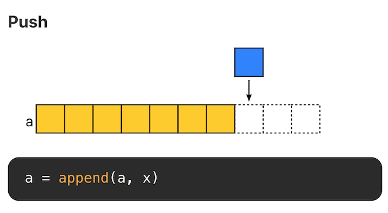
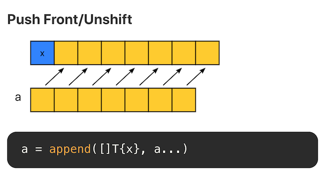
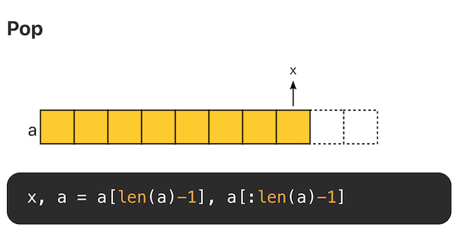
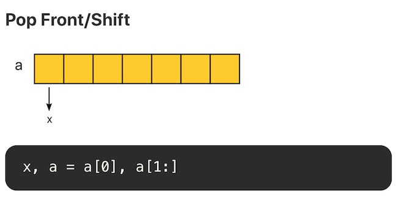

## 1 切片的本质

在 Go 语言中，切片(slice)可能是使用最为频繁的数据结构之一，切片类型为处理同类型数据序列提供一个方便而高效的方式。

### 1.1 数组

Go 的切片(slice)是在数组(array)之上的抽象数据类型，数组类型定义了长度和元素类型。例如， `[3]int` 类型表示由 3 个 int 整型组成的数组，数组以索引方式访问，例如表达式 s[n] 访问数组的第 n 个元素。数组的长度是固定的，长度是数组类型的一部分。长度不同的 2 个数组是不可以相互赋值的，因为这 2 个数组属于不同的类型。例如下面的代码是不合法的：

```go
a := [3]int{1, 2, 3}
b := [4]int{2, 4, 5, 6}
a = b // cannot use b (type [4]int) as type [3]int in assignment
```

在 C 语言中，数组变量是指向第一个元素的指针，但是 Go 语言中并不是。Go 语言中，数组变量属于值类型(value type)，因此当一个数组变量被赋值或者传递时，实际上会复制整个数组。例如，将 a 赋值给 b，修改 a 中的元素并不会改变 b 中的元素：

```go
a := [...]int{1, 2, 3} // ... 会自动计算数组长度
b := a
a[0] = 100
fmt.Println(a, b) // [100 2 3] [1 2 3]
```

为了避免复制数组，一般会传递指向数组的指针。例如：

```go
func square(arr *[3]int) {
	for i, num := range *arr {
		(*arr)[i] = num * num
	}
}

func TestArrayPointer(t *testing.T) {
	a := [...]int{1, 2, 3}
	square(&a)
	fmt.Println(a) // [1 4 9]
	if a[1] != 4 && a[2] != 9 {
		t.Fatal("failed")
	}
}
```

### 1.2 切片

数组固定长度，缺少灵活性，大部分场景下会选择使用基于数组构建的功能更强大，使用更便利的切片类型。

切片使用字面量初始化时和数组很像，但是不需要指定长度：

```go
languages := []string{"Go", "Python", "C"}
```

或者使用内置函数 make 进行初始化，make 的函数定义如下：

```go
func make([]T, len, cap) []T
```

第一个参数是 `[]T`，T 即元素类型，第二个参数是长度 len，即初始化的切片拥有多少个元素，第三个参数是容量 cap，容量是可选参数，默认等于长度。使用内置函数 `len` 和 `cap` 可以得到切片的长度和容量，例如：

```go
func printLenCap(nums []int) {
	fmt.Printf("len: %d, cap: %d %v\n", len(nums), cap(nums), nums)
}

func TestSliceLenAndCap(t *testing.T) {
	nums := []int{1}
	printLenCap(nums) // len: 1, cap: 1 [1]
	nums = append(nums, 2)
	printLenCap(nums) // len: 2, cap: 2 [1 2]
	nums = append(nums, 3)
	printLenCap(nums) // len: 3, cap: 4 [1 2 3]
	nums = append(nums, 3)
	printLenCap(nums) // len: 4, cap: 4 [1 2 3 3]
}
```

容量是当前切片已经预分配的内存能够容纳的元素个数，如果往切片中不断地增加新的元素。如果超过了当前切片的容量，就需要分配新的内存，并将当前切片所有的元素拷贝到新的内存块上。因此为了减少内存的拷贝次数，容量在比较小的时候，一般是以 2 的倍数扩大的，例如 2 4 8 16 ...，当达到 2048 时，会采取新的策略，避免申请内存过大，导致浪费。Go 语言源代码 [runtime/slice.go](https://golang.org/src/runtime/slice.go) 中是这么实现的，不同版本可能有所差异：

```go
newcap := old.cap
doublecap := newcap + newcap
if cap > doublecap {
	newcap = cap
} else {
	if old.len < 1024 {
		newcap = doublecap
	} else {
		// Check 0 < newcap to detect overflow
		// and prevent an infinite loop.
		for 0 < newcap && newcap < cap {
			newcap += newcap / 4
		}
		// Set newcap to the requested cap when
		// the newcap calculation overflowed.
		if newcap <= 0 {
			newcap = cap
		}
	}
}
```

切片和数组很相似，按照下标进行索引。切片本质是一个数组片段的描述，包括了数组的指针，这个片段的长度和容量(不改变内存分配情况下的最大长度)。

```go
struct {
    ptr *[]T
    len int
    cap int
}
```

切片操作并不复制切片指向的元素，创建一个新的切片会复用原来切片的底层数组，因此切片操作是非常高效的。下面的例子展示了这个过程：



```go
nums := make([]int, 0, 8)
nums = append(nums, 1, 2, 3, 4, 5)
nums2 := nums[2:4]
printLenCap(nums)  // len: 5, cap: 8 [1 2 3 4 5]
printLenCap(nums2) // len: 2, cap: 6 [3 4]

nums2 = append(nums2, 50, 60)
printLenCap(nums)  // len: 5, cap: 8 [1 2 3 4 50]
printLenCap(nums2) // len: 4, cap: 6 [3 4 50 60]
```

- nums2 执行了一个切片操作 `[2, 4)`，此时 nums 和 nums2 指向的是同一个数组。
- nums2 增加 2 个元素 50 和 60 后，将底层数组下标 [4] 的值改为了 50，下标[5] 的值置为 60。
- 因为 nums 和 nums2 指向的是同一个数组，因此 nums 被修改为 [1, 2, 3, 4, 50]。

## 2 切片操作及性能

搞清楚切片的本质之后，理解切片的常用操作的性能就容易很多了。

Go 语言在 Github 上的官方 wiki - [SliceTricks](https://github.com/golang/go/wiki/SliceTricks) 介绍了切片常见的操作技巧。另一个项目 [Go Slice Tricks Cheat Sheet](https://ueokande.github.io/go-slice-tricks/) 将这些操作以图片的形式呈现了出来，非常直观。

### 2.1 Copy



### 2.2 Append



切片有三个属性，指针(ptr)、长度(len) 和容量(cap)。append 时有两种场景：

- 当 append 之后的长度小于等于 cap，将会直接利用原底层数组剩余的空间。
- 当 append 后的长度大于 cap 时，则会分配一块更大的区域来容纳新的底层数组。

> 因此，为了避免内存发生拷贝，如果能够知道最终的切片的大小，预先设置 cap 的值能够获得最好的性能。

### 2.3 Delete



切片的底层是数组，因此删除意味着后面的元素需要逐个向前移位。每次删除的复杂度为 O(N)，因此切片不合适大量随机删除的场景，这种场景下适合使用链表。

### 2.4 Delete(GC)


删除后，将空余的位置置空，有助于垃圾回收。

### 2.5 Insert



insert 和 append 类似。即在某个位置添加一个元素后，将该位置后面的元素再 append 回去。复杂度为 O(N)。因此，不适合大量随机插入的场景。

### 2.6 Filter



当原切片不会再被使用时，就地 filter 方式是比较推荐的，可以节省内存空间。

### 2.7 Push



在末尾追加元素，不考虑内存拷贝的情况，复杂度为 O(1)。



在头部追加元素，时间和空间复杂度均为 O(N)，不推荐。

### 2.8 Pop



尾部删除元素，复杂度 O(1)



头部删除元素，如果使用切片方式，复杂度为 O(1)。但是需要注意的是，底层数组没有发生改变，第 0 个位置的内存仍旧没有释放。如果有大量这样的操作，头部的内存会一直被占用。

## 3 性能陷阱

### 3.1 大量内存得不到释放

在已有切片的基础上进行切片，不会创建新的底层数组。因为原来的底层数组没有发生变化，内存会一直占用，直到没有变量引用该数组。因此很可能出现这么一种情况，原切片由大量的元素构成，但是我们在原切片的基础上切片，虽然只使用了很小一段，但底层数组在内存中仍然占据了大量空间，得不到释放。比较推荐的做法，使用 `copy` 替代 `re-slice`。

```go
func lastNumsBySlice(origin []int) []int {
	return origin[len(origin)-2:]
}

func lastNumsByCopy(origin []int) []int {
	result := make([]int, 2)
	copy(result, origin[len(origin)-2:])
	return result
}
```

上述两个函数的作用是一样的，取 origin 切片的最后 2 个元素。

- 第一个函数直接在原切片基础上进行切片。
- 第二个函数创建了一个新的切片，将 origin 的最后两个元素拷贝到新切片上，然后返回新切片。

我们可以写两个测试用例来比较这两种方式的性能差异：

在此之前呢，我们先实现 2 个辅助函数：

```go
func generateWithCap(n int) []int {
	rand.Seed(time.Now().UnixNano())
	nums := make([]int, 0, n)
	for i := 0; i < n; i++ {
		nums = append(nums, rand.Int())
	}
	return nums
}

func printMem(t *testing.T) {
	t.Helper()
	var rtm runtime.MemStats
	runtime.ReadMemStats(&rtm)
	t.Logf("%.2f MB", float64(rtm.Alloc)/1024./1024.)
}
```

- `generateWithCap` 用于随机生成 n 个 int 整数，64位机器上，一个 int 占 8 Byte，128 * 1024 个整数恰好占据 1 MB 的空间。
- `printMem` 用于打印程序运行时占用的内存大小。

接下来分别为 `lastNumsBySlice` 和 `lastNumsByCopy` 实现测试用例：

```go
func testLastChars(t *testing.T, f func([]int) []int) {
	t.Helper()
	ans := make([][]int, 0)
	for k := 0; k < 100; k++ {
		origin := generateWithCap(128 * 1024) // 1M
		ans = append(ans, f(origin))
	}
	printMem(t)
	_ = ans
}

func TestLastCharsBySlice(t *testing.T) { testLastChars(t, lastNumsBySlice) }
func TestLastCharsByCopy(t *testing.T)  { testLastChars(t, lastNumsByCopy) }
```

- 测试用例内容非常简单，随机生成一个大小为 1 MB 的切片( 128*1024 个 int 整型，恰好为 1 MB)。
- 分别调用 `lastNumsBySlice` 和 `lastNumsByCopy` 取切片的最后两个元素。
- 最后然后打印程序所占用的内存。

运行结果如下：

```bash
$ go test -run=^TestLastChars  -v
=== RUN   TestLastCharsBySlice
--- PASS: TestLastCharsBySlice (0.31s)
    slice_test.go:73: 100.14 MB
=== RUN   TestLastCharsByCopy
--- PASS: TestLastCharsByCopy (0.28s)
    slice_test.go:74: 3.14 MB
PASS
ok      example 0.601s
```

结果差异非常明显，`lastNumsBySlice` 耗费了 100.14 MB 内存，也就是说，申请的 100 个 1 MB 大小的内存没有被回收。因为切片虽然只使用了最后 2 个元素，但是因为与原来 1M 的切片引用了相同的底层数组，底层数组得不到释放，因此，最终 100 MB 的内存始终得不到释放。而 `lastNumsByCopy` 仅消耗了 3.14 MB 的内存。这是因为，通过 `copy`，指向了一个新的底层数组，当 origin 不再被引用后，内存会被垃圾回收(garbage collector, GC)。

如果我们在循环中，显示地调用 `runtime.GC()`，效果会更加地明显：

```go
func testLastChars(t *testing.T, f func([]int) []int) {
	t.Helper()
	ans := make([][]int, 0)
	for k := 0; k < 100; k++ {
		origin := generateWithCap(128 * 1024) // 1M
		ans = append(ans, f(origin))
		runtime.GC()
	}
	printMem(t)
	_ = ans
}
```

`lastNumsByCopy` 内存占用直接下降到 0.15 MB。

```bash
$ go test -run=^TestLastChars  -v
=== RUN   TestLastCharsBySlice
--- PASS: TestLastCharsBySlice (0.37s)
    slice_test.go:75: 100.14 MB
=== RUN   TestLastCharsByCopy
--- PASS: TestLastCharsByCopy (0.34s)
    slice_test.go:76: 0.15 MB
PASS
ok      example 0.723s
```

## 附 推荐与参考

- [Go Slices: usage and internals](https://blog.golang.org/slices-intro)
- [Go 语言陷阱 - 数组和切片](https://geektutu.com/post/hpg-gotchas-array-slice.html)
- [Go 语言笔试面试题汇总](https://geektutu.com/post/qa-golang.html)
- [七天用Go从零实现系列](https://geektutu.com/post/gee.html)
