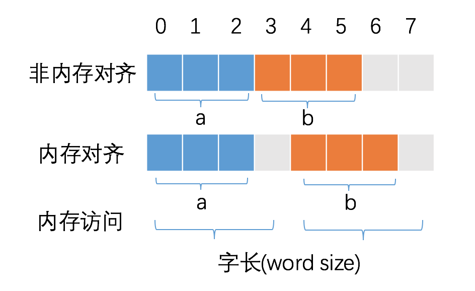
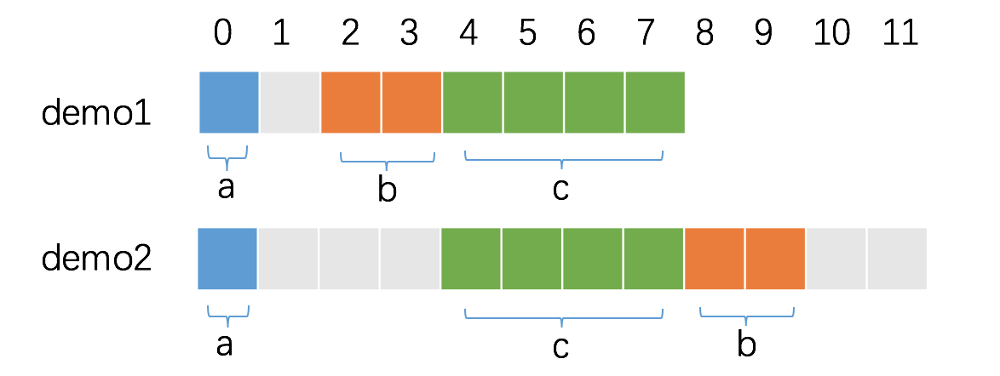

## 1 如何计算结构体占用的空间

在 Go 语言中，我们可以使用 `unsafe.Sizeof` 计算出一个数据类型实例需要占用的字节数。

```go
package main

import (
	"fmt"
	"unsafe"
)

type Args struct {
    num1 int
    num2 int
}

type Flag struct {
    num1 int16
    num2 int32
}

func main() {
    fmt.Println(unsafe.Sizeof(Args{}))
    fmt.Println(unsafe.Sizeof(Flag{}))
}
```

运行上面的例子将会输出：

```bash
$ go run main.go
16
8
```

- `Args` 由 2 个 int 类型的字段构成，在 64位机器上，一个 int 占 8 字节，因此存储一个 `Args` 实例需要 16 字节。
- `Flag` 由一个 int32 和 一个 int16 的字段构成，成员变量占据的字节数为 4+2 = 6，但是 `unsafe.Sizeof` 返回的结果为 8 字节，多出来的 2 字节是内存对齐的结果。

因此，一个结构体实例所占据的空间等于各字段占据空间之和，再加上内存对齐的空间大小。

## 2 内存对齐

### 2.1 为什么需要内存对齐

CPU 访问内存时，并不是逐个字节访问，而是以字长（word size）为单位访问。比如 32 位的 CPU ，字长为 4 字节，那么 CPU 访问内存的单位也是 4 字节。

这么设计的目的，是减少 CPU 访问内存的次数，加大 CPU 访问内存的吞吐量。比如同样读取 8 个字节的数据，一次读取 4 个字节那么只需要读取 2 次。

CPU 始终以字长访问内存，如果不进行内存对齐，很可能增加 CPU 访问内存的次数，例如：



变量 a、b 各占据 3 字节的空间，内存对齐后，a、b 占据 4 字节空间，CPU 读取 b 变量的值只需要进行一次内存访问。如果不进行内存对齐，CPU 读取 b 变量的值需要进行 2 次内存访问。第一次访问得到 b 变量的第 1 个字节，第二次访问得到 b 变量的后两个字节。

从这个例子中也可以看到，内存对齐对实现变量的原子性操作也是有好处的，每次内存访问是原子的，如果变量的大小不超过字长，那么内存对齐后，对该变量的访问就是原子的，这个特性在并发场景下至关重要。

简言之：合理的内存对齐可以提高内存读写的性能，并且便于实现变量操作的原子性。

> 参考 [Purpose of memory alignment](https://stackoverflow.com/questions/381244/purpose-of-memory-alignment)

### 2.1 unsafe.Alignof

在上面的例子中，`Flag{}` 两个字段占据了 6 个字节，但是最终对齐后的结果是 8 字节。Go 语言中内存对齐需要遵循什么规律呢？

`unsafe` 标准库提供了 `Alignof` 方法，可以返回一个类型的对齐值，也可以叫做对齐系数或者对齐倍数。例如：

```go
unsafe.Alignof(Args{}) // 8
unsafe.Alignof(Flag{}) // 4
```

- `Args{}` 的对齐倍数是 8，`Args{}` 两个字段占据 16 字节，是 8 的倍数，无需占据额外的空间对齐。 
- `Flag{}` 的对齐倍数是 4，因此 `Flag{}` 占据的空间必须是 4 的倍数，因此，6 内存对齐后是 8 字节。

### 2.2 对齐保证(align guarantee)

Go 官方文档 [Size and alignment guarantees - golang spec](https://golang.org/ref/spec#Size_and_alignment_guarantees) 描述了 `unsafe.Alignof` 的规则。

> 1. For a variable x of any type: unsafe.Alignof(x) is at least 1.
> 2. For a variable x of struct type: unsafe.Alignof(x) is the largest of all the values unsafe.Alignof(x.f) for each field f of x, but at least 1.
> 3. For a variable x of array type: unsafe.Alignof(x) is the same as the alignment of a variable of the array's element type.

- 对于任意类型的变量 x ，`unsafe.Alignof(x)` 至少为 1。
- 对于 struct 结构体类型的变量 x，计算 x 每一个字段 f 的 `unsafe.Alignof(x.f)`，`unsafe.Alignof(x)` 等于其中的最大值。
- 对于 array 数组类型的变量 x，`unsafe.Alignof(x)` 等于构成数组的元素类型的对齐倍数。

> A struct or array type has size zero if it contains no fields (or elements, respectively) that have a size greater than zero. Two distinct zero-size variables may have the same address in memory.

没有任何字段的空 struct{} 和没有任何元素的 array 占据的内存空间大小为 0，不同的大小为 0 的变量可能指向同一块地址。

## 3 struct 内存对齐的技巧

### 3.1 合理布局减少内存占用

假设一个 struct 包含三个字段，`a int8`、`b int16`、`c int64`，顺序会对 struct 的大小产生影响吗？我们来做一个实验：

```go
type demo1 struct {
	a int8
	b int16
	c int32
}

type demo2 struct {
	a int8
	c int32
	b int16
}

func main() {
	fmt.Println(unsafe.Sizeof(demo1{})) // 8
	fmt.Println(unsafe.Sizeof(demo2{})) // 12
}
```

答案是会产生影响。每个字段按照自身的对齐倍数来确定在内存中的偏移量，字段排列顺序不同，上一个字段因偏移而浪费的大小也不同。

接下来逐个分析，首先是 demo1：

- a 是第一个字段，默认是已经对齐的，从第 0 个位置开始占据 1 字节。
- b 是第二个字段，对齐倍数为 2，因此，必须空出 1 个字节，偏移量才是 2 的倍数，从第 2 个位置开始占据 2 字节。
- c 是第三个字段，对齐倍数为 4，此时，内存已经是对齐的，从第 4 个位置开始占据 4 字节即可。

因此 demo1 的内存占用为 8 字节。

其实是 demo2：

- a 是第一个字段，默认是已经对齐的，从第 0 个位置开始占据 1 字节。
- c 是第二个字段，对齐倍数为 4，因此，必须空出 3 个字节，偏移量才是 4 的倍数，从第 4 个位置开始占据 4 字节。
- b 是第三个字段，对齐倍数为 2，从第 8 个位置开始占据 2 字节。

demo2 的对齐倍数由 c 的对齐倍数决定，也是 4，因此，demo2 的内存占用为 12 字节。



因此，在对内存特别敏感的结构体的设计上，我们可以通过调整字段的顺序，减少内存的占用。

### 3.2 空 struct{} 的对齐

空 `struct{}` 大小为 0，作为其他 struct 的字段时，一般不需要内存对齐。但是有一种情况除外：即当 `struct{}` 作为结构体最后一个字段时，需要内存对齐。因为如果有指针指向该字段, 返回的地址将在结构体之外，如果此指针一直存活不释放对应的内存，就会有内存泄露的问题（该内存不因结构体释放而释放）。

因此，当 `struct{}` 作为其他 struct 最后一个字段时，需要填充额外的内存保证安全。我们做个试验，验证下这种情况。

```go
type demo3 struct {
	c int32
	a struct{}
}

type demo4 struct {
	a struct{}
	c int32
}

func main() {
	fmt.Println(unsafe.Sizeof(demo3{})) // 8
	fmt.Println(unsafe.Sizeof(demo4{})) // 4
}
```

可以看到，`demo4{}` 的大小为 4 字节，与字段 c 占据空间一致，而 `demo3{}` 的大小为 8 字节，即额外填充了 4 字节的空间。

## 附 推荐与参考

- [Go 语言笔试面试题汇总](https://geektutu.com/post/qa-golang.html)
- [七天用Go从零实现系列](https://geektutu.com/post/gee.html)
